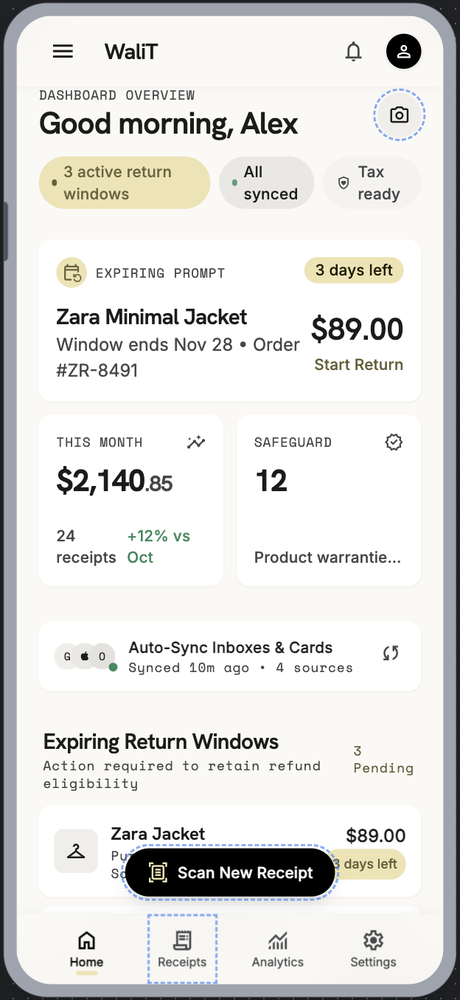
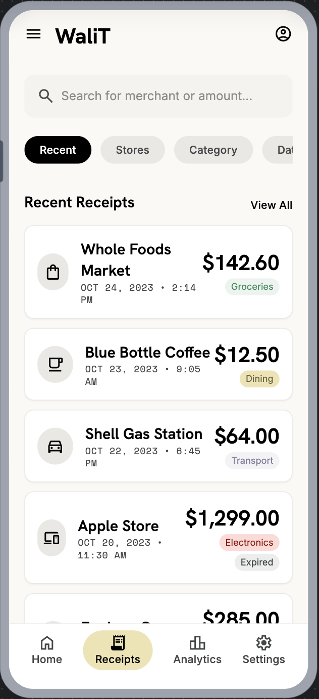
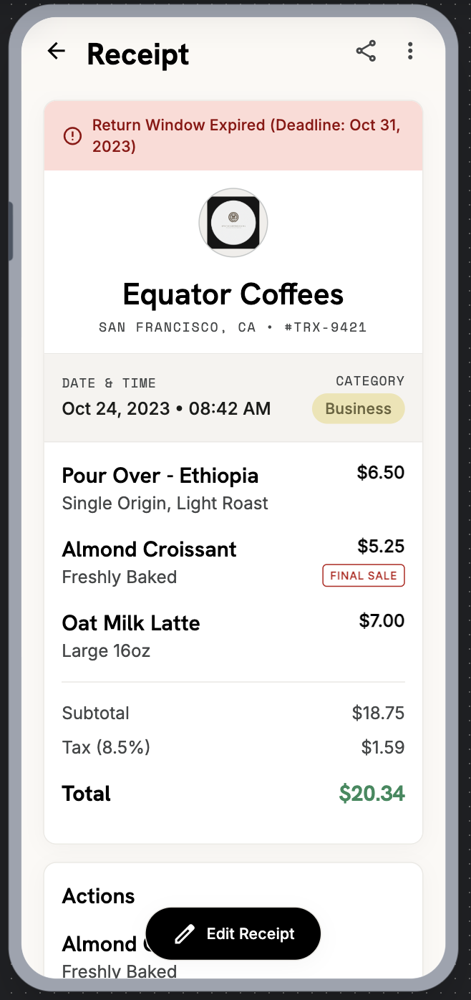
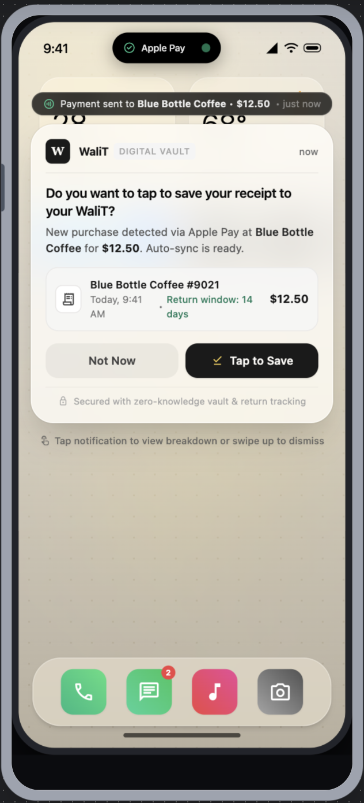
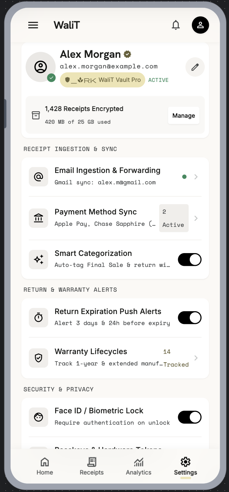

# WaliT

This was the idea for my first startup! It's **A tap-to-pay receipt wallet with a self-built blockchain integrity layer.** Instead of saving physical receipts, or being bothered to write my email/phone number into a checkout kiosk, WaliT is the idea that I can tap to receive my receipt like an NFT on my phone. By storing your receipt on a blockchain, we can prove it hasn't been tampered with, that it is authentic and only yours. 

For the time being this is just a public proof of concept to show the idea, and my knowledge of Swift/C++. I am continuing to work on more features for WaliT in my spare time in its own private repository. Feel free to ask me about more!

## Screenshots

<p align="center">
   
   
   
   
   
</p>


I built this as a proof-of-concept that hands you a cryptographically verifiable digital receipt the instant you tap to pay. Every receipt is hashed by a hand-written C++ SHA-256 engine, chained to the receipt before it like a blockchain, and stored in MongoDB — so tampering with a receipt after the fact is mathematically detectable.

It's a small project deliberately built to span three disciplines at once: **native iOS**, **systems-level C++**, and **backend/database engineering** — wired together into one coherent, working feature rather than three disconnected demos.

> Portfolio / resume project. Not a production payments product — see [Scope](#scope--disclaimers).

---

## Why this project

Most portfolio apps pick one lane: a SwiftUI app that calls a REST API, or a C++ algorithms exercise, or a CRUD backend. WaliT was built to demonstrate that these aren't separate skills in practice — a real feature (verifiable receipts) needs a native client, a correctness-critical algorithm, and a persistent data layer to actually agree with each other, byte for byte, across three different languages.

---

## Skills demonstrated

| Area | What's here |
|---|---|
| **Native iOS / Swift** | SwiftUI app, MVVM architecture, `async/await` networking, four fully designed screens |
| **C++ / systems programming** | SHA-256 implemented from FIPS 180-4 primitives — no OpenSSL, no shortcuts — plus a blockchain-style chain validator, unit-tested against known SHA-256 test vectors |
| **Swift ↔ C++ interop** | Swift 5.9+'s native C++ interoperability (no Objective-C shim) — Swift constructs and reads C++ structs, `std::string`, and `std::vector<T>` directly |
| **Blockchain fundamentals** | Linked hash chain, genesis block, `previousHash` linkage, and a tamper-detection algorithm that pinpoints the exact broken block |
| **Backend / API design** | Node.js + Express REST API with chain-linkage validation on write and full chain re-verification on read |
| **NoSQL data modeling** | MongoDB + Mongoose, each document representing one immutable block |
| **Payments integration (simulated)** | Stripe Terminal-style tap-to-pay lifecycle, modeled for the POC without live payment processing |
| **End-to-end system design** | One feature, three languages, one canonical data format that has to match exactly on every side |

---

## How it works

1. User taps **Scan Receipt** in the app.
2. A simulated tap-to-pay event produces a receipt (merchant, line items, totals).
3. The receipt is serialized into a canonical string and handed to the **C++ engine** for hashing — chained to the previous block's hash, exactly like a blockchain.
4. The new block is POSTed to the backend, which independently **re-derives the same hash** and rejects anything that doesn't match or doesn't chain correctly.
5. On any receipt, the app (and the API) can walk the *entire* chain and prove — cryptographically — whether it's intact.
6. Edit a receipt directly in MongoDB, bypassing the app entirely, and the next verification pass flags exactly which block broke:

   ```
   GET /receipts/verify → { "valid": false, "firstInvalidIndex": 1 }
   ```

This is the core idea: **integrity isn't a flag in the database, it's something you can recompute and prove.**

---

## Architecture

```
┌──────────────────────────────────────────────┐
│              iOS App (Swift / SwiftUI)        │
│                                                │
│  Simulated Tap-to-Pay ──▶ ReceiptListViewModel│
│                                    │           │
│                                    ▼           │
│                     C++ Hashing Engine         │
│                (SHA-256 · block assembly ·     │
│                    chain validation)           │
│                     via Swift/C++ interop      │
└───────────────────────┬────────────────────────┘
                         │ HTTPS
                         ▼
              ┌─────────────────────┐
              │  Node.js REST API   │
              │  (Express)          │
              │  - validates chain  │
              │    linkage on write │
              │  - re-derives hash  │
              │    (Node crypto)    │
              └──────────┬──────────┘
                         │ Mongoose
                         ▼
              ┌─────────────────────┐
              │      MongoDB        │
              │ receipts collection │
              │ (1 document = 1     │
              │  block in the chain)│
              └─────────────────────┘
```

The same **canonical hashing format** — `blockIndex + timestamp + JSON(lineItems) + total + previousHash + nonce` — is implemented independently in C++ (the source of truth) and in Node.js (`crypto.createHash('sha256')`), so a receipt hashed on-device and a receipt re-verified on the server produce byte-identical results.

---

## Screens

| Screen | What it shows |
|---|---|
| **Login** | Mocked auth, biometric/passkey buttons, "end-to-end encrypted" branding |
| **Receipt List** | Searchable, filterable list of receipts with category pills and a floating scan button |
| **Receipt Detail** | Full line-item breakdown, totals, payment context, and a live **Verified / Tampered** badge computed from the chain |
| **Scan / Capture** | Camera-style capture UI that (for this POC) triggers the simulated payment flow instead of a real camera |

---

## Tech stack

| Layer | Technology |
|---|---|
| Mobile UI | Swift 5.10, SwiftUI, iOS 17+ |
| Hashing / chain engine | C++17, built from scratch (SHA-256 primitives + chain validator) |
| Swift/C++ bridge | Swift's native C++ interoperability mode (Swift 5.9+) |
| Payments simulation | Stripe Terminal-style simulated reader flow |
| Backend | Node.js, Express 4 |
| Database | MongoDB 7, Mongoose 8 |
| Build tooling | CMake (C++ unit tests), Swift Package Manager, XcodeGen |

---

## Verified & tested

Everything below has been built *and independently run*, not just written:

- **C++ engine** — `cmake --build build && ctest` — SHA-256 output matches the standard published test vectors; chain validation correctly detects both a tampered field and a broken `previousHash` link.
- **Swift/C++ bridge** — `swift test` — proves Swift can construct C++ structs (including `std::vector<LineItem>`) and get correct tamper detection back through the real C++ `validateChain()`, not a mock.
- **Backend API** — all four endpoints (`GET /receipts`, `GET /receipts/:id`, `POST /receipts`, `GET /receipts/verify`) tested end-to-end against a real MongoDB instance, including rejecting a bad chain link (`409`), rejecting a forged hash (`400`), and catching a receipt edited directly in the database.

**Open item:** the SwiftUI app and the C++ engine are both complete and independently proven (see above), but wiring the C++ module into the `.xcodeproj` build graph is currently blocked by a Swift/C++ cross-module interop issue specific to this Xcode release — the app target's Clang dependency scanner doesn't yet resolve a separate C++ module correctly. This is a toolchain issue, not a design gap; the fix is either an Xcode update or restructuring the C++ target once the root cause is pinned down.

---

## Getting started

```bash
# Backend
cd backend && npm install
brew services start mongodb-community   # or run your own MongoDB 7 instance
node server.js                          # → http://localhost:3000

# C++ engine (standalone build + tests)
cmake -S . -B build && cmake --build build
cd build && ctest --output-on-failure

# Swift/C++ interop bridge (standalone build + tests)
swift test

# iOS app project
xcodegen generate                       # generates WaliT.xcodeproj
open WaliT.xcodeproj
```

---

## Project structure

```
WaliT/
├── cpp/               # C++ SHA-256 + chain validation engine
├── tests/              # C++ unit tests (CMake/ctest)
├── Package.swift        # Swift Package wrapping the C++ engine for interop testing
├── SwiftTests/          # Swift/C++ bridge tests
├── WaliT/                # SwiftUI app source (Views, ViewModels, Models, Services)
├── backend/            # Node.js/Express REST API + Mongoose models
└── PRD_Walit.md         # Full product requirements document
```

---

## Scope & disclaimers

This is a resume/portfolio proof-of-concept: no real payment processing, no App Store distribution, no production security hardening. The C++ SHA-256 implementation exists to demonstrate the algorithm from first principles — real-world systems should use an audited crypto library.
